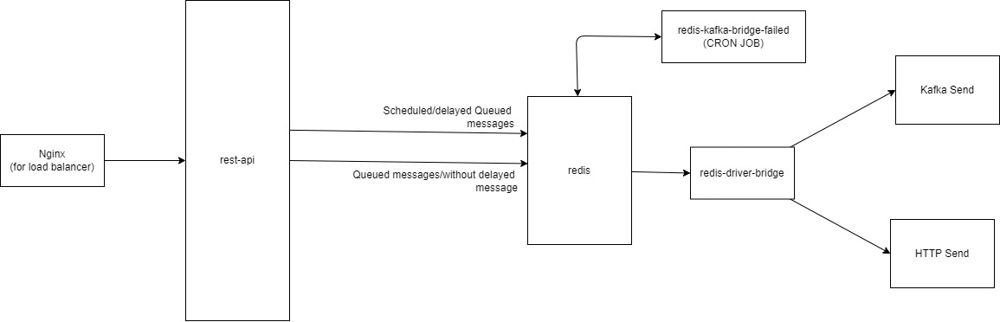

# Enterprise Async Messaging System (EAMS)

Enterprise Async Messaging System is made to sending different type messaging with multiple drivers like(Kafka, Redis, etc)

# How to run

```
docker-compose -f docker-compose-all.yml up -d --build
```

# Architecture



# Important configuration

This is global configuration.

```js
export const SCHEDULED_QUEUE_PROCESS_NAME = 'REDIS_PROCESS';
export const SCHEDULED_KAFKA_QUEUE_NAME = 'SCHEDULED__REDIS__KAFKA__DRIVERS';
export const SCHEDULED_HTTP_QUEUE_NAME = 'SCHEDULED__REDIS__HTTP__DRIVERS';

export const KAFKA_QUEUE_MAX_LIMIT = 100000;
export const HTTP_QUEUE_MAX_LIMIT = 100000;

//cron task delay run
export const SCHEDULED_FAILED_RETRY_CRON = '*/30 * * * * *';

//cron task maximum item retry.
export const SCHEDULED_FAILED_RETRY_CRON_MAXIMUM_JOB_RETRY_LENGTH = 10000;

//cron task, how many times retry when a queue item is failed. How much time will retry equation (SCHEDULED_FAILED_RETRY_CRON in second * SCHEDULED_FAILED_MAX_ITEM_ATTEMPT) and unit will be in second or cron time.
export const SCHEDULED_FAILED_MAX_ITEM_ATTEMPT = 3000;

export const REQUEST_ID_HEADER: string = 'x-request-id';
export const REQUEST_LOG_HEADER_ID: string = 'x-log-id';
export const USE_JSON_LOGGER: string = 'true';
export const DEBUG = process.env.DEBUG;

export const HTTP_DRIVER_CLIENT_TIMEOUT = 10000;
```

# Important environment variables

## rest-api 

```bash
REDIS_HOST=localhost
REDIS_PORT=6378
APP_PORT=30001
```

## redis-queue-failed

```bash
REDIS_HOST=localhost
REDIS_PORT=6378
APP_PORT=30003
```

## redis-driver-bridge

```bash
REDIS_HOST=localhost
REDIS_PORT=6378
APP_PORT=30002
KAFKA_CLIENT_CONFIG_VALUE="{"clientId":"redis-driver_kafka-bridge","brokers":["kafka:9092"]}"
HTTP_CLIENT_CONFIG_VALUE="{"baseURL": "https://postman-echo.com","url": "/post"}"
```

# Extra

- Kafka Driver
  - 1-5ms latency
- HTTP Driver
  - Timeout 10s
  - Request Method: POST
  - Response Type: JSON
